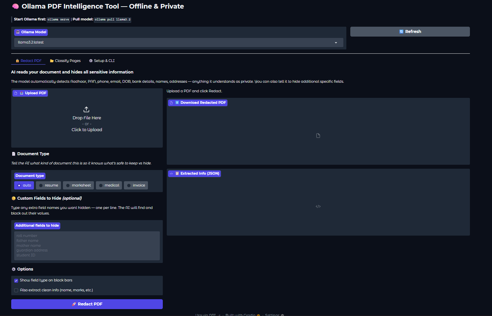
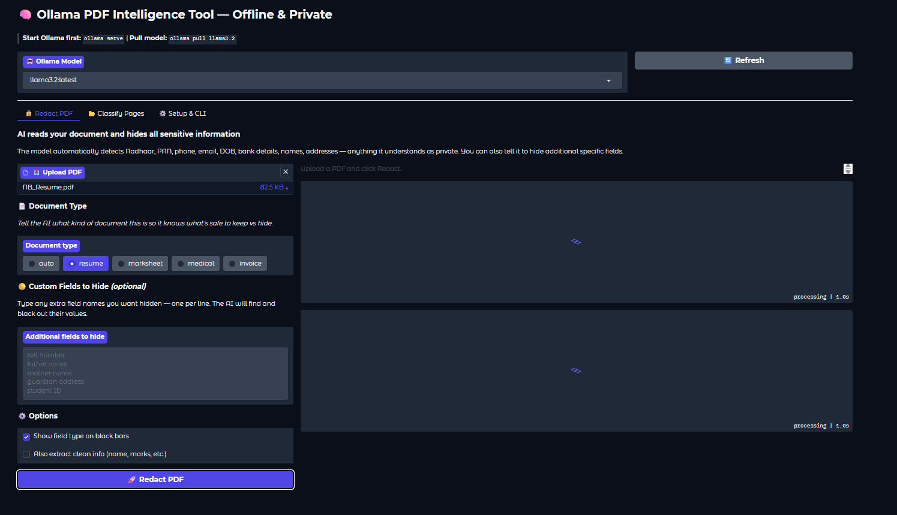
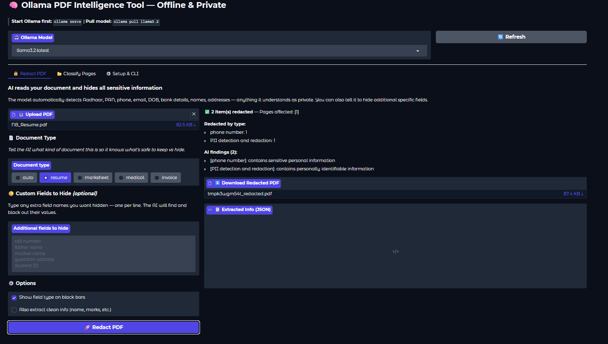

# Ollama Offline PDF Intelligence Tool

A fully offline AI-powered PDF processing system using Ollama. Two core capabilities:

## Features

### 1. 🔒 PII Redaction (`redact_pdf.py`)
- Extracts key info from documents (marksheets, certificates, IDs)
- Automatically detects and hides sensitive data:
  - Aadhaar numbers
  - PAN card numbers
  - Phone numbers
  - Email addresses
  - Date of birth
  - Bank account / IFSC numbers
- Outputs a clean JSON summary + redacted text

### 2. 📂 PDF Page Classifier (`classify_pdf.py`)
- You define up to N custom categories (e.g. "Invoice", "Resume", "Legal", etc.)
- Upload any multi-page PDF
- The model identifies which pages belong to which category
- Outputs a per-page classification report + category summary

---

## Setup

### Step 1 – Install Ollama
```bash
curl -fsSL https://ollama.com/install.sh | sh
```

### Step 2 – Pull the model (one-time, then fully offline)
```bash
# Recommended: llama3.2 (fast, good at structured tasks, ~2GB)
ollama pull llama3.2

# OR for better accuracy with larger RAM (8GB+)
ollama pull llama3.1:8b
```

### Step 3 – Install Python dependencies
```bash
pip install -r requirements.txt
```

### Step 4 – Start Ollama server (keep running in background)
```bash
ollama serve
```

---

## Usage

### PII Redaction
```bash
python redact_pdf.py --pdf path/to/marksheet.pdf --model llama3.2
```

### Page Classification
```bash
python classify_pdf.py --pdf path/to/document.pdf --categories categories.json --model llama3.2
```

### Interactive UI (Recommended)
```bash
python app.py
```
Then open http://localhost:7860 in your browser.

---

## Model Recommendations

| Use Case | Model | RAM Needed | Pull Command |
|----------|-------|-----------|-------------|
| Fast, light | llama3.2 | 4 GB | `ollama pull llama3.2` |
| Better accuracy | llama3.1:8b | 8 GB | `ollama pull llama3.1:8b` |
| Best accuracy | llama3.1:70b | 48 GB | `ollama pull llama3.1:70b` |
| Vision (scanned PDFs) | llava | 8 GB | `ollama pull llava` |

> For scanned PDFs (images inside PDF), use llava model — it can read text from images.


## Screenshots

### Home Screen


### AI-Powered PDF Redaction


### Document Classification

---

## Output Examples

### Redaction Output
```json
{
  "extracted_info": {
    "student_name": "Rahul Sharma",
    "school": "Delhi Public School",
    "board": "CBSE",
    "year": "2024",
    "subjects": {"Physics": "92", "Chemistry": "88", "Mathematics": "95"},
    "total_percentage": "91.4%"
  },
  "redacted_fields": ["aadhaar_number", "dob", "phone"],
  "redacted_text": "Student Name: Rahul Sharma\nAadhaar: [REDACTED]\n..."
}
```

### Classification Output
```json
{
  "classification": {
    "Invoice": [1, 3, 7],
    "Resume": [2],
    "Legal Contract": [4, 5, 6],
    "Unclassified": [8]
  },
  "per_page": [
    {"page": 1, "category": "Invoice", "confidence": "high", "reason": "Contains GST number, amount, vendor details"},
    ...
  ]
}
```
